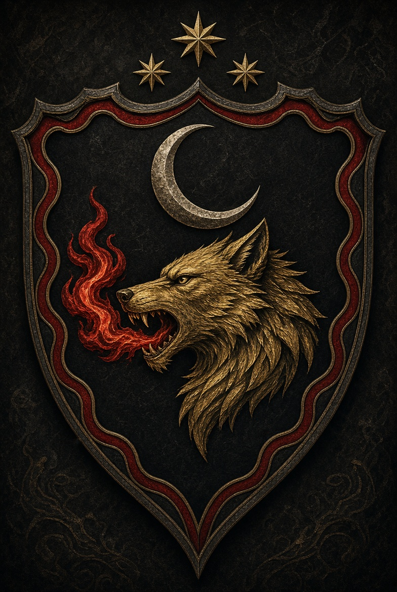
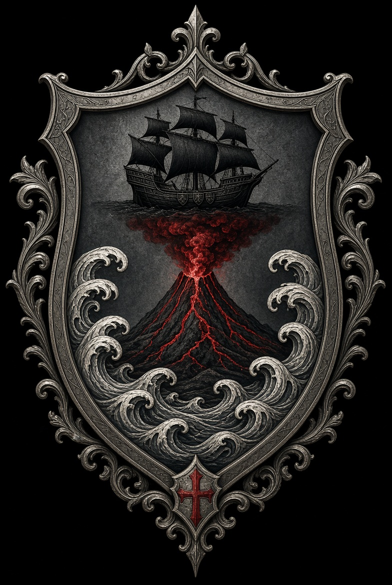
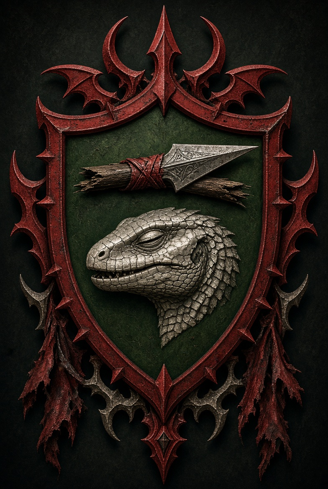
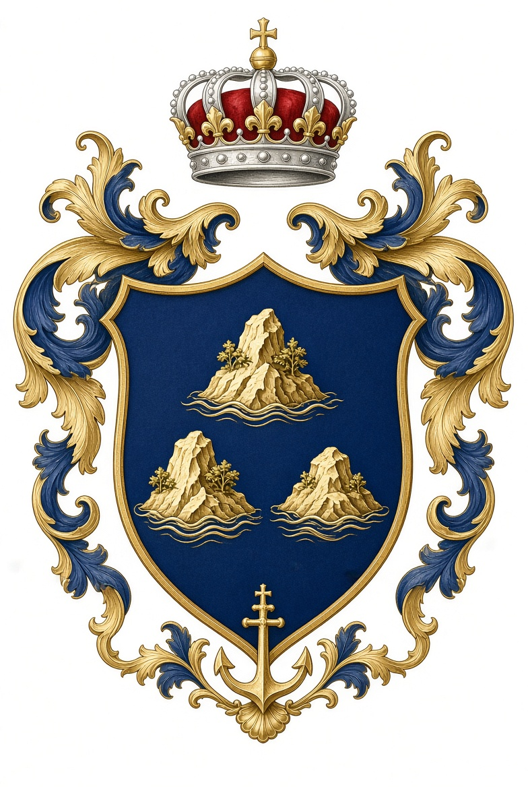
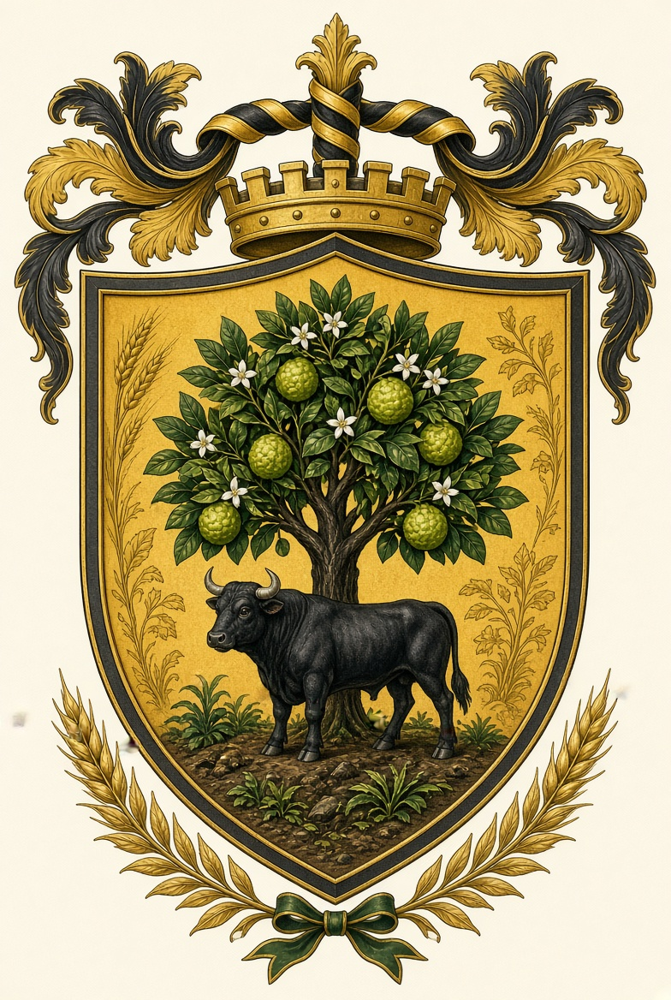
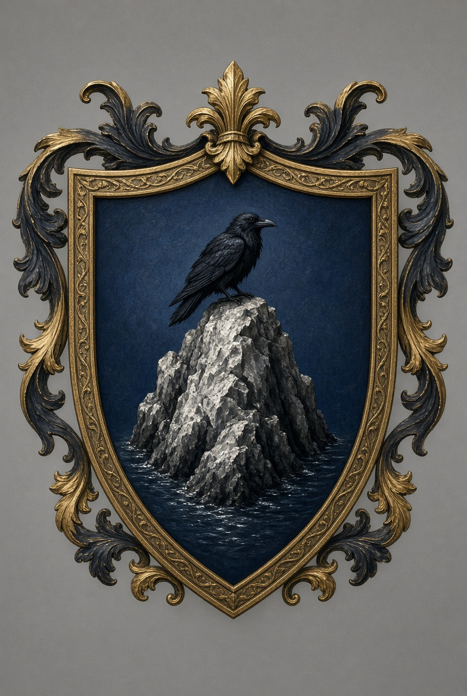
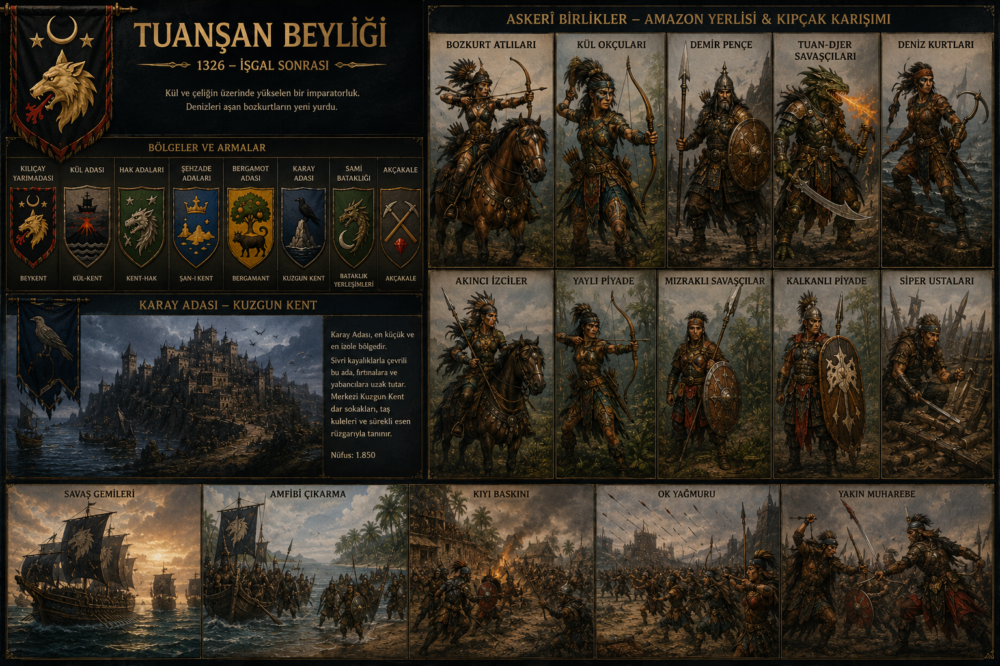
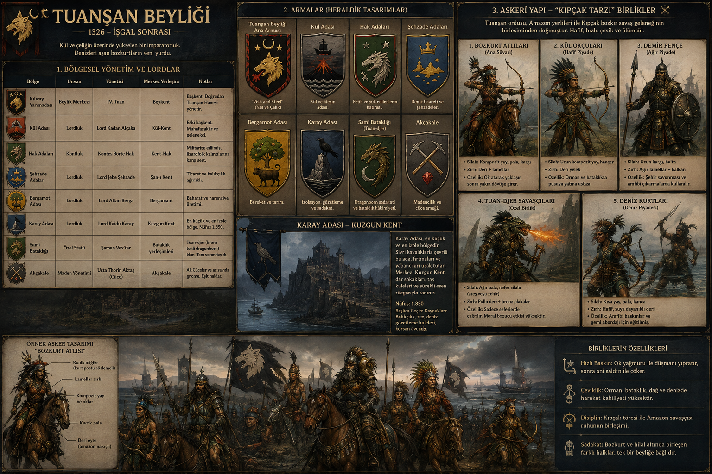

# Tuanşan Beyliği – Bölgeler, Armalar, Lordlar ve Askerî Yapı
**1326 (İşgal Sonrası)**

---

## 1. Bölgesel Yönetim ve Lordlar

| Bölge                  | Unvan                  | Yönetici                    | Merkez Yerleşim      | Notlar |
|------------------------|------------------------|-----------------------------|----------------------|--------|
| **Kılıçay Yarımadası** | Beylik Merkezi         | **IV. Tuan**                | Beykent              | Başkent. Doğrudan Tuanşan Hanesi yönetir. |
| **Kül Adası**          | Lordluk                | **Lord Kadan Alçaka**       | Kül-Kent             | Eski başkent. Muhafazakâr ve gelenekçi. |
| **Hak Adaları**        | Kontluk                | **Kontes Börte Hak**        | Kent-Hak             | Militarize edilmiş, lizardfolk kalıntılarına karşı sert. |
| **Şehzade Adaları**    | Lordluk                | **Lord Jebe Şehzade**       | Şan-ı Kent           | Ticaret ve balıkçılık ağırlıklı. |
| **Bergamot Adası**     | Lordluk                | **Lord Altan Berga**        | Bergamant            | Baharat ve narenciye üretimi. |
| **Karay Adası**        | Lordluk                | **Lord Kaidu Karay**        | Kuzgun Kent          | En küçük ve en izole bölge. Nüfus 1.850. |
| **Sami Bataklığı**     | Özel Statü             | **Şaman Vex’tar**           | Bataklık yerleşimleri| Tuan-djer (bronz tenli dragonborn) klanı. Tam vatandaşlık. |
| **Akçakale**           | Maden Yönetimi         | **Usta Thorin Aktaş** (Cüce)| Akçakale             | Ak Cüceler ve az sayıda gnome. Eşit haklar. |

---

## 2. Armalar (Heraldik Tasarımlar)

### Tuanşan Beyliği Ana Arması
- **Kalkan:** Siyah zemin üzerinde altın bir bozkurt başı (sola bakan), bozkurtun ağzından kırmızı alevler çıkar.
- **Üstte:** Gümüş bir hilal ve altında üç altın yıldız (Şan soyuna bağlılığı simgeler).
- **Kenar:** Kırmızı ve siyah dalgalı bordür (deniz ve kan).
- **Motto (Common):** “Ash and Steel” (Kül ve Çelik)

### Kül Adası Arması
- **Kalkan:** Koyu gri zemin, ortada kırmızı bir yanardağ (kül ve ateş), etrafında gümüş dalgalar.
- **Üstte:** Siyah bir gemi silueti.
- **Anlam:** Keşif gemisinin oturduğu ada ve volkanik topraklar.

### Hak Adaları Arması
- **Kalkan:** Yeşil zemin üzerinde gümüş bir kertenkele (lizardfolk) kafası, kafanın üstünde kırık bir mızrak.
- **Kenar:** Kan kırmızısı bordür.
- **Anlam:** Fetih ve yok edilen yerli halkın hatırası (zafer olarak gösterilir).

### Şehzade Adaları Arması
- **Kalkan:** Mavi zemin, üç altın ada silueti, üstlerinde gümüş bir taç.
- **Anlam:** Prenslere (şehzadelere) ait adalar ve deniz ticareti.

### Bergamot Adası Arması
- **Kalkan:** Altın zemin, yeşil bir bergamot ağacı, ağacın altında siyah bir boğa.
- **Anlam:** Bereket ve tarım.

### Karay Adası Arması
- **Kalkan:** Koyu mavi zemin, tek bir gümüş kayalık ada, ada üzerinde siyah bir kuzgun.
- **Anlam:** İzolasyon, gözetleme ve sadakat.

### Sami Bataklığı (Tuan-djer) Arması
- **Kalkan:** Bataklık yeşili zemin, bronz renkli bir ejderha pençesi, pençenin içinde gümüş bir ay.
- **Anlam:** Dragonborn sadakati ve bataklık hâkimiyeti.

### Akçakale Arması
- **Kalkan:** Gri zemin, iki çapraz kazma (biri altın, biri gümüş), ortada kırmızı bir elmas.
- **Anlam:** Madencilik ve cüce emeği.

---

## 3. Askerî Yapı – “Kıpçak Tarzı” Birlikler

Tuanşan ordusu, klasik bozkır Kıpçak/Kuman savaş geleneğini adalar ve kıyı coğrafyasına uyarlamıştır.  
Hafif, hareketli, yay ağırlıklı ve disiplinli birliklerden oluşur. Karayip adalarındaki tarihî Kıpçak kökenli veya bozkır göçmeni birliklerin tarzına benzer:  
hızlı baskın, ok yağmuru, sonra yakın muharebe.

### Temel Birlik Tipleri

#### 1. **Bozkurt Atlıları** (Ana Süvari)
- **Silah:** Kompozit yay + pala (kıvrık kılıç) + kargı
- **Zırh:** Deri + lamellar (pul zırh), genellikle koyu yeşil veya siyah
- **Miğfer:** Konik, boyun korumalı, bazen kurt postu
- **Özellik:** Çok hızlı, ok atarak yaklaşır, sonra yakın dövüşe girer.
- **Sayı:** Beyliğin omurgası.

#### 2. **Kül Okçuları** (Hafif Piyade)
- **Silah:** Uzun kompozit yay + hançer
- **Zırh:** Sadece deri yelek ve kolluk
- **Özellik:** Orman ve bataklıkta mükemmel. Pusuya yatma ustası.

#### 3. **Demir Pençe** (Ağır Piyade – Az sayı)
- **Silah:** Uzun kargı + balta
- **Zırh:** Ağır lamellar + kalkan
- **Özellik:** Surlu şehir savunması ve amfibi çıkarmalarda kullanılır.

#### 4. **Tuan-djer Savaşçıları** (Özel Birlik)
- Bronz tenli dragonbornlar.
- **Silah:** Ağır pala + nefes silahı (ateş veya zehir – klan geleneğine göre)
- **Zırh:** Kendi pullu derileri + ek bronz plakalar
- **Özellik:** Sadece seferlerde çağrılır. Moral bozucu etkisi yüksektir.

#### 5. **Deniz Kurtları** (Deniz Piyadesi)
- **Silah:** Kısa yay + pala + kanca
- **Zırh:** Hafif, suya dayanıklı deri
- **Özellik:** Amfibi baskınlar ve gemi abordajı için eğitilmiş.

### Örnek Asker Tasarımı – “Bozkurt Atlısı”

**İsim:** Er Jebe  
**Birlik:** 3. Bozkurt Sancağı  
**Görünüm:**
- Koyu yeşil lamellar zırh (göğüs ve omuzlar)
- Siyah deri pantolon ve çizme
- Konik miğfer, yanlarında kurt kuyruğu püsküller
- Belinde kıvrık pala, sırtında kompozit yay ve 40 ok
- Atı: Kısa boylu, dayanıklı bozkır tipi (adaya uyarlanmış)
- Yüz: Güneş yanığı, kısa sakal, sol kaşında eski bir ok yarası

**Savaş Tarzı:**  
Düşmana 80–100 adım mesafeden ok yağmuru açar, sonra hızla kapanıp pala ile doğrar. Geri çekilmeyi de çok iyi bilir.

---

## 4. Sancak ve Sembol Sistemi

Her lordluk kendi sancağını taşır, ancak tüm birlikler **Tuanşan bozkurt** bayrağını da taşır.  
Sancaklar genellikle yatay veya dikey, ipek veya kalın keten kumaştan yapılır.  
Renkler: Siyah, kırmızı, altın ve koyu yeşil hâkimdir.

---

*Bu belge Tuanşan Beyliği’nin bölgesel, heraldik ve askerî yapısını tanımlar.  
Son güncelleme: 1326 (İşgal Sonrası)*

