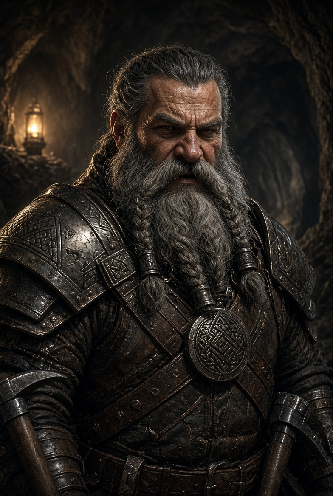
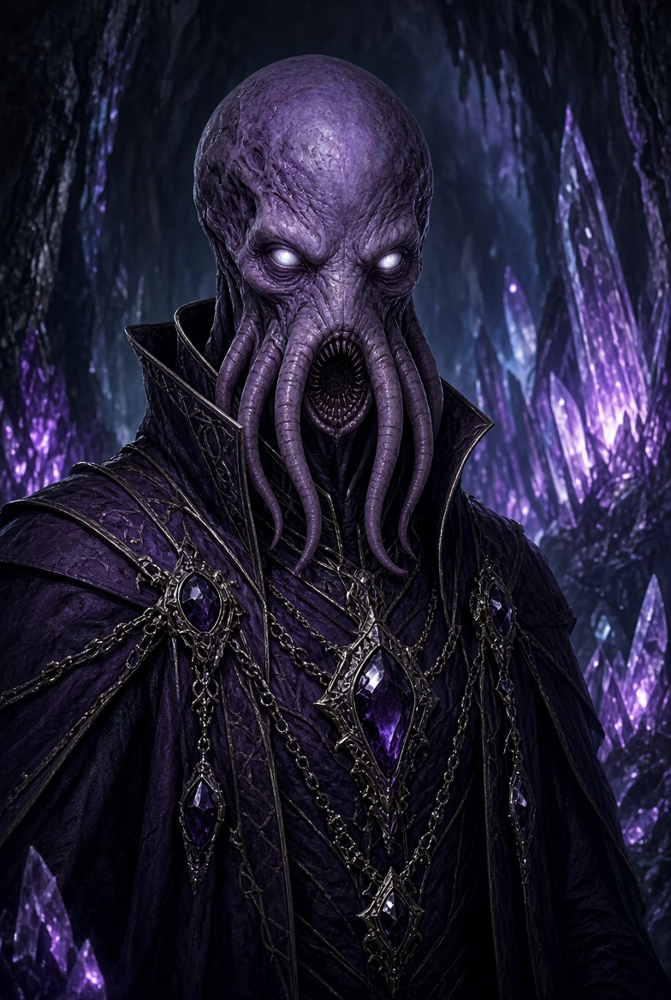
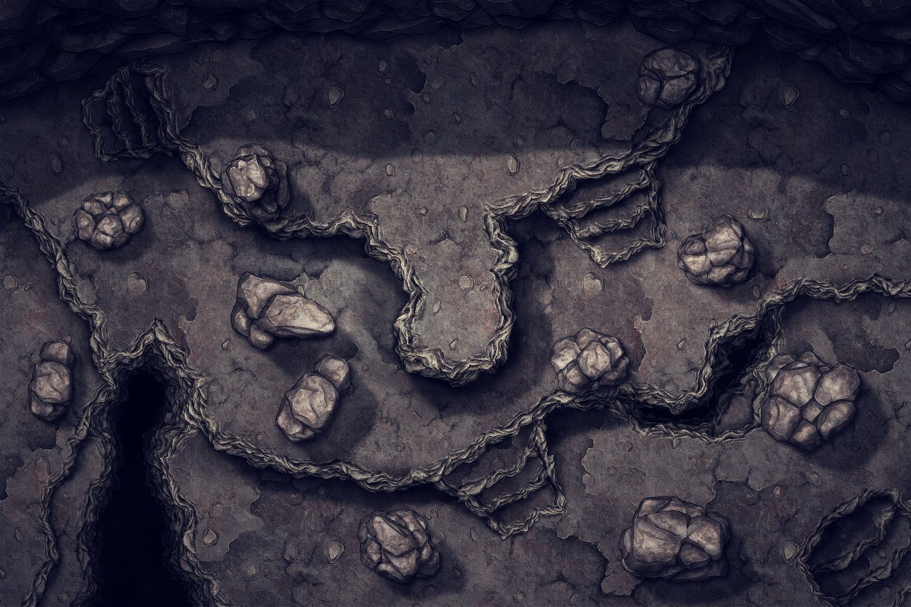
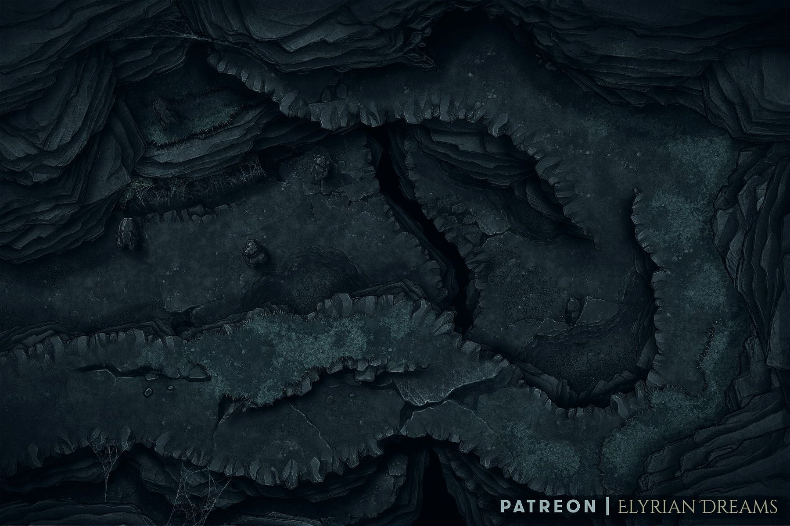
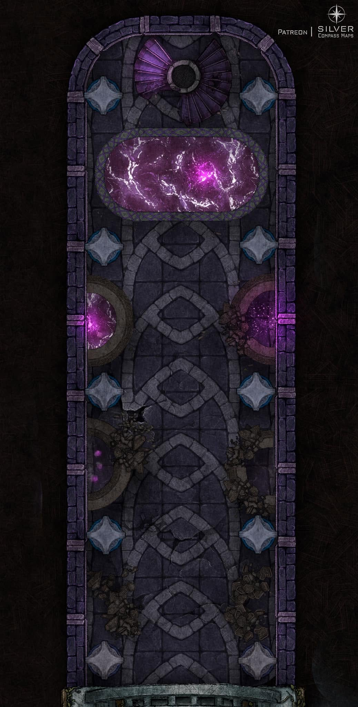
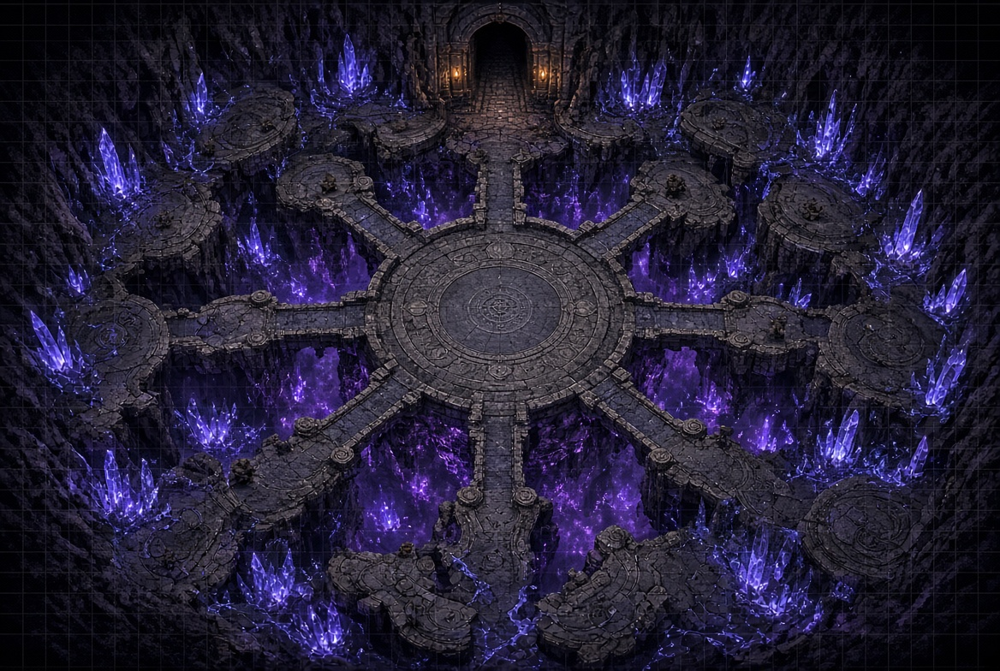
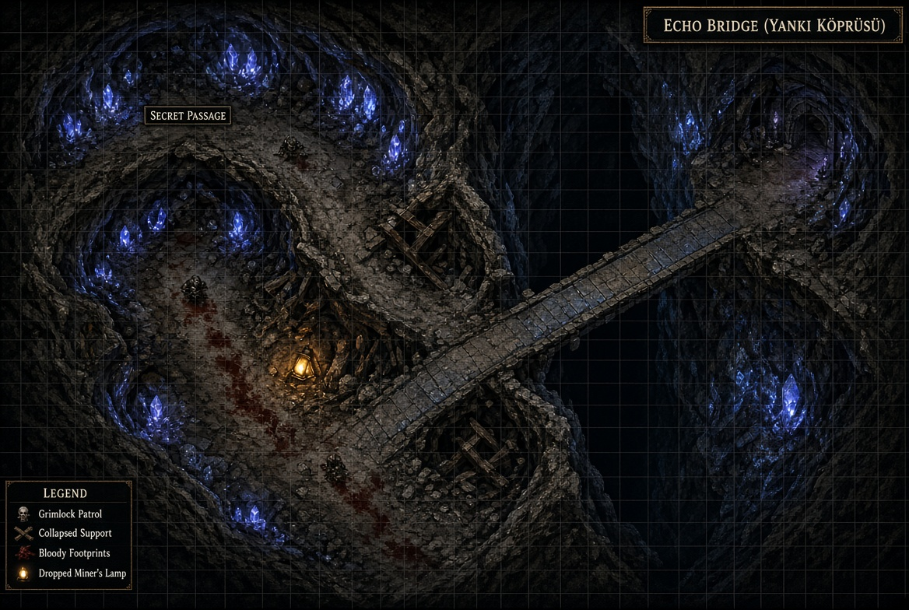
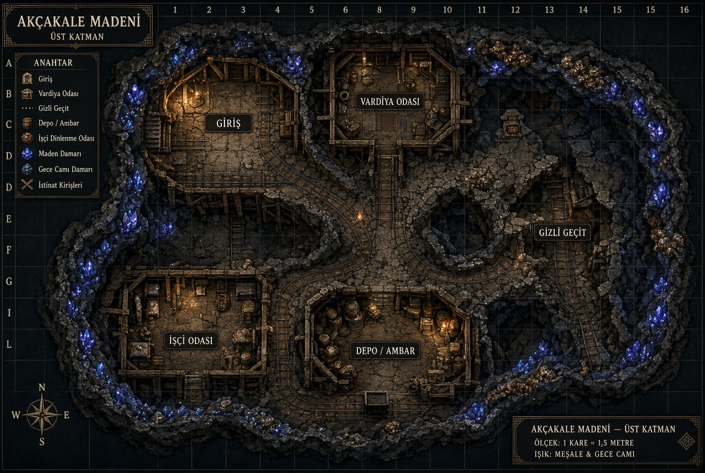
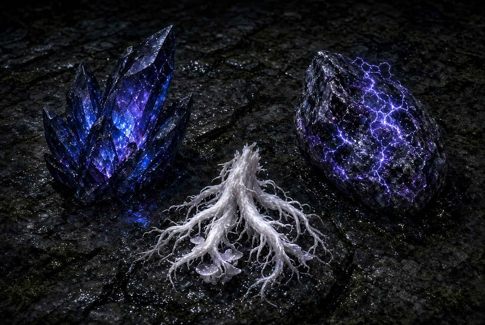

# Akçakale’nin Altındaki Yankı

> **D&D 5.5E / 2024 uyumlu one-shot**  
> 3–5 oyuncu · 6–8. seviye · 4–6 saat · Gerilim, yeraltı keşfi ve ahlaki seçimler

Akçakale madenlerinde üç ay önce bulunan gizli geçit, Tuanşan Beyliği’nin halktan ve ordunun büyük bölümünden sakladığı bir tehdide açılır. Oyuncular, General Şehrazad Veyran’ın resmî kayıtlara geçirilmeyen keşif ekibidir: geçidin ardında ne olduğunu öğrenmeli, mümkünse bunun Tuanşan’a yayılmasını engellemelidirler.

# Özet

Akçakale’nin Altındaki Yankı bir grubun hiç bilmedikleri yeni bir koloni devletindeki keşif görevini temel alır. Ekip krallığın emri ile uzak Ana kıtadan getirilen yüksek becerilere sahip bir araştırma ekibidir. asıl amaç madende bulunan gizli geçit ve mağaradaki gizemli olayları anlamak ve raporlarmak, eski keşif ekibinden izler bulmak ve mağrayı keşfederek haritalamaktır, fakat bu yolda maceracıların karşılarına beklenmedik engeller çıkar. Bu enggeler bir mindflayer tarafından tamamen körleştirilmiş ve zihinleri kontrol edilen, yıllar içinde başkalaşım geçiren kadim bir ırk olan grimlock'lar ve onların efendileri "Yüce Düşünür"dür.

---

## Hızlı başlangıç

| Başlık | Bilgi |
| --- | --- |
| Zaman | 1326, İşgal Sonrası |
| Başlangıç | Akçakale madenleri, Tuanşan Beyliği |
| Açık görev | Gizli geçidi araştırmak, somut kanıtla dönmek |
| Gizli görev | Mind Flayer tehdidini doğrulamak ve mümkünse yok etmek |
| Başarı ölçütü | Geçidin ardını haritalamak, tehdidi belgelemek veya durdurmak |
| Ana düşman | Ulthar-Vesh adlı bir Mind Flayer ve köleleştirdiği Grimlocklar |

### Parti seviyesi ve final ayarı

| Parti | Önerilen final |
| --- | --- |
| 5 karakter, 6. seviye | 1 Mind Flayer + 3 Grimlock |
| 4 karakter, 7. seviye | 1 Mind Flayer + 4 Grimlock |
| 3 karakter, 8. seviye | 1 Mind Flayer + 4 Grimlock; kristal titreşimleri iki turda bir |

Mind Flayer’ın zihinsel etkileri serttir. 2024 kurallarında karakterleri uzun süre oyundan düşürmemek için, başarısız kurtarışların etkisini kısa tutmak ve kaçış yolları bırakmak tavsiye edilir.

---

## Tuanşan ve Akçakale bağlamı

Tuanşan Beyliği insan-merkezli ve katı hiyerarşili bir devlettir. Akçakale’de yaşayan Ak Cüceler ve az sayıdaki gnome, istisnai haklara sahiptir; madenin ekonomik önemi nedeniyle sözleri normalde ağırlık taşır. Bu ayrıcalık, mağara olayı kamuya açıklanırsa hızla siyasî baskıya dönüşebilir.

Gizli geçit yeni bir damar aranırken çökmüş bir duvarın arkasında bulundu. İlk kazı ekibi tüneli açtıktan sonra, geçidin yüzlerce metre ileride geniş bir mağaraya açıldığını gördü. O tarihten beri mağaradan ulumalar, düzenli taş vuruşları ve soluk mavi-mor ışık yansımaları geliyor.

Haber yalnızca maden yönetimi, General Veyran ve sınırlı sayıda güvenlik görevlisi tarafından bilinir. Orduya haber verilirse Beylik meclisi derhal askerî operasyon ve madenin kapatılmasını isteyecektir.

---

## Önemli karakterler

### General Şehrazad Veyran

Tuanşan sınır istihbaratında yüksek rütbeli, sakin ve hesapçı bir komutandır. Görevi kendi kanallarıyla yürüttüğü için ne Bey’e ne de düzenli orduya tam bir açıklama yapmıştır.

- **Görünen amacı:** Madenin güvenliği ve halk paniğinin önlenmesi.
- **Asıl amacı:** Dağın altında yirmi yıl önce kaybettiği gayriresmî keşif ekibinin izini ve geri döndüğünü sandığı zihinsel tehdidi doğrulamak.
- **Rol yapma notu:** Açık tehdit etmez; her cümlesi sanki önceden hesaplanmış gibidir. Bilgiyi asla tümüyle paylaşmaz.
- **Oyunculara söylediği:** “Bir orduyu harekete geçirecek haber, önce doğru olmalı.”

### Başmühendis Tikkit Alevdüğüm

Akçakale’nin gnome başmühendisi. Mağaradaki ışık düzeni, işlenmiş yüzeyler ve ritmik seslerin akıllı bir medeniyete işaret ettiğini savunur.

- **İsteği:** Önce gözlem, sonra mümkünse iletişim. Geçidi patlatmak istemez.
- **Sunduğu destek:** Eski maden planı, titreşimleri kaydeden basit bir aygıt ve iki adet **Sessiz Kök** merhemi.
- **Sırrı:** İlk ekibin gördüğü kabartmalardan birini kopyalamıştır; kabartma, Grimlocklardan daha eski bir yerleşimin varlığını gösterir.

### Grimone Akşan

Akşan Cücelerinin başı ve Akçakale’deki kazı işlerinin maden ustasıdır. Resmî yönetimdeki Usta Thorin Aktaş ile madenin geleceği konusunda açıkça çatışmaz; ancak yeraltı vardiyalarında gerçek söz sahibi Grimone’dur.

- **İnancı:** Grimlockları, drowlara benzettiği, “temizlenmesi gereken” bir ırk olarak görür.
- **İsteği:** Geçidin bombalanması, mağaranın yakılması ve hiçbir yaratığın yüzeye çıkmaması.
- **Rol yapma notu:** Kaba ve açık sözlüdür; önyargısını güvenlik gerekçesiyle meşrulaştırır.
- **Sunduğu destek:** Bir patlatma düzeneği, halat, kazma ve haritalama ekipmanları.

Grimone’un yaklaşımı haklı çıkmamalıdır: Grimlocklar tehlikelidir, fakat mağaradaki şiddetin kaynağı onların varlığı değil Ulthar-Vesh’in köleleştirmesidir.

### Ulthar-Vesh, “Yüce Düşünür”

Mağaranın derinlerinde yerleşmiş bir Mind Flayer. Grimlockları zihin baskısı, korku ve yiyecek aracılığıyla kendine bağlamıştır. Akçakale’nin titreşimlerini inceleyerek yüzeye açılacak güvenli yollar arar.

- **Hedefi:** Madenin işçi düzenini ve Tuanşan’daki karar vericileri gözlemlemek; sonra sessizce nüfuz etmek ve madenlerdeki bu eski medeniyet gibi yeni gelen halkı da köleleştirmek.
- **Korkusu:** Araştırmalrını Kaybetmek.
- **Kaçış planı:** Son ana kadar savaşmaz; kazanamayacağını anlarsa eşyaları alıp arka tünelden kaçmak ister.

---

## Ödüller ve ekonomi

Altın, bu evrende standart maceradan daha bol ve daha düşük alım gücüne sahiptir. Aşağıdaki değerler önceki ölçeğin ellide biridir.

| Başarı | Ödül |
| --- | --- |
| Güvenilir rapor ve somut kanıt | Karakter başına 5 altın |
| Tehdidi/medeniyeti kesin belgelemek | Karakter başına ek 10 altın |
| Ulthar-Vesh’in cesedini Şehrazad’a teslim etmek | Karakter başına ek 20 altın ve bir askerî/siyasî iyilik |
| Bulunan sıradan olmayan cevher ve eşya | Değerin üçte biri ekibin |

Şehrazad ayrıca altın yerine borç silme, askerî af, güvenli geçiş belgesi veya Tuanşan bürokrasisinde tek seferlik destek teklif edebilir.

---

## Olay örgüsü

### 1. Brifing: kapatılmış vardiya

Macera, vardiyası erken bitirilmiş ve dışarıyla bağlantısı kesilmiş Akçakale’de başlar. Şehrazad görev emrini sözlü verir; yazılı emrin bulunmadığını özellikle belirtir. Tikkit ve Grimone, karakterlere birbirine zıt iki yaklaşım sunar.

Oyuncuların ilk seçimi, yanlarına kimi ve neyi alacaklarıdır:

- Tikkit’in araştırma ekipmanı ve Sessiz Kökleri,
- Grimone’un patlayıcısı ve muhafızı,
- ya da yalnızca kendi ekipmanlarıyla gizli ilerlemek.

### 2. Gizli geçit

Tünel pürüzsüz, doğal olmayan kesim izleri taşır. Duvarlarda Gece Camı damarları vardır; bunlar sesle titreşip soluk mavi-mor ışık verir. Uzaklardan gelen ulumalar, zaman zaman düzenli taş darbeleriyle kesilir.

Bu bölümde aşağıdakilerden en az ikisini kullanın:

- Çökmek üzere olan bir tahkimat ve Athletics/araç kullanımıyla geçiş,
- Gece Camı’nın titreşimlerine dair Arcana veya Investigation kontrolü,
- İlk kazı ekibinin düşürdüğü bir madenci lambası ve kanlı çizme izi,
- Uzaktan algılanan Grimlock devriyesinden saklanmak için Stealth.

### 3. Sessiz Kök Bahçesi

Nemli kayalarda beyaz kökler büyür. Bunlar ezilip sürüldüğünde bir saat boyunca kullanıcının istemsiz seslerini azaltır. Karakterler üç güvenli doz, dikkatli hasatla bir doz daha elde eder.

Bahçede, zihinsel baskı yüzünden yönünü kaybetmiş yalnız bir Grimlock bulunur. Saldırmak yerine taşları dinler; etkisiz hâle getirilen baskı, onun korkmuş ve aç bir avcı olduğunu gösterir. Bu sahne Grimone’un yargısını sorgulatır.

### 4. Kırık gözlem odası

İşlenmiş taş duvarlı eski bir oda. Kabartmalar, mağaranın bir zamanlar farklı bir yeraltı halkı tarafından gözlem istasyonu olarak kullanıldığını gösterir. Grimlocklar sonradan gelmiştir.

Burada bulunan kayıt ya da kabartma, Ulthar-Vesh’in mağaraya sonradan yerleştiğinin kanıtıdır. Tikkit bunu Tuanşan’a götürmek ister; Grimone ise yaratıkları temizlemek için yeterli delil sayar.

### 5. Yankı Köprüsü — ilk encounter

Dar bir kaya köprüsü, dipsiz gibi görünen bir yarığın üzerinden geçer. 3–4 Grimlock, bir madenciye ait ganimetleri Ulthar-Vesh’e götürmektedir.

Karakterler şu yolları seçebilir:

- **Gizlilik:** Sessiz Kök, dikkat dağıtıcı ses veya havada ilerleme işe yarar.
- **Savaş:** Grimlocklar köprüde sıkıştırmaya, rakiplerini yarığa itmeye çalışır.
- **Yanıltma:** Titreşim ve ses yönünü değiştirmek devriyeyi yanlış tünele çeker.

Devriye mensupları “Yüce Düşünür için” ifadesini kullanır. Bu, mağarada onları yönlendiren zeki bir varlık olduğunun ilk açık kanıtıdır.

### 6. Düşünce Kuyusu — final

Gece Camı damarlarıyla çevrili, eski yapıların bulunduğu bir oyuk. Ulthar-Vesh burada Grimlockları yönetir ve kristallerden gelen titreşimleri bir uyarı ağı gibi kullanır.

Finalde Mind Flayer arka hatta kalır; Grimlocklar köprü ve dar geçitleri kapatır. Her tur sonunda etkin bir kristal damarının yakınında olan karakterler Constitution kurtarışı yapar. Başarısız olan karakter sağır olur veya yere düşer. Bir kristali hedefli hasarla, uygun araçlarla ya da başarılı bir Arcana/Investigation girişimiyle devre dışı bırakmak mümkündür.

#### Kaçış mekaniği

Canı ciddi şekilde azaldığında Ulthar-Vesh, aşağıdaki üç eşyayı alıp arka tünele yönelir:

1. **Yıldırım Taşı**
2. **Kâhinin Kemik Haritası**
3. **Gece Camı Odağı**

Üçü de elindeyse odağı kullanarak takipçilerin yön algısını kısa süreliğine bozar ve gizli çıkışa ulaşmaya çalışır. Karakterler eşyaları daha önce almış, yok etmiş veya kaçış yolunu kapatmışsa Mind Flayer geri çekilemez ve sonuna kadar dövüşür.

Ulthar-Vesh ölürse cesedi değerli bir kanıttır. Cesedi Şehrazad’a eksiksiz ulaştırmak, ek ödülün şartıdır.

---

## Buluntular

| Eşya | Kullanım / değer |
| --- | --- |
| **Gece Camı** | Titreşimle parlayan mavi-siyah kristal. Değerli zanaat malzemesi; küçük bir parça yaklaşık 3 altın. |
| **Sessiz Kök** | Bir saat süreyle istemsiz sesi azaltan beyaz ot. Nadir, tek kullanımlık araç. |
| **Yıldırım Taşı** | Kristal enerjisi depolayan taş. Büyülü eşya yapımında malzeme; yaklaşık 6–10 altın. |
| **Kâhinin Kemik Haritası** | Yeraltı geçitleri ve üç gizli yüzey çıkışını gösteren, titreşimle okunabilir harita. |
| **Gece Camı Odağı** | Ulthar-Vesh’in kaçışına yardım eden bilinmeyen aygıt. Zihinsel/illüzyon büyüsü araştırmaları için değerli kanıt. |

---

## Masa ve setting kuralları

### Gizlilik

- Karakterler Tuanşan ordusunu, Bey’i veya halkı göreve dair bilgilendiremez.
- Bu kuralı çiğnemek görevin anında bitmesi anlamına gelmez; ama Şehrazad’ın güvenini ve ödülleri etkiler.
- Karakterlerin kendi aralarında tartışması ve farklı gruplara bilgi sızdırması serbesttir; sonuçları hikâyede görünür olmalıdır.

### Grimlocklar

- Grimlocklar kördür; görme yerine işitme ve titreşimi kullanırlar.
- Sessizlik, havada hareket, yumuşak yüzeyler ve yanıltıcı sesler onlara karşı anlamlı taktiklerdir.
- Mağaradaki Grimlockların çoğu Ulthar-Vesh’in baskısı altındadır. Her biri masum değildir, fakat türlerinin varlığı otomatik olarak bir yok etme gerekçesi değildir.

### Dinlenme ve kaynak yönetimi

- Bu macera tek bir uzun dinlenmeyle başlar; mağarada güvenli uzun dinlenme yoktur.
- Düşünce Kuyusu’na varmadan önce en fazla bir kısa dinlenmeye izin verin. Bunun bedeli, Ulthar-Vesh’in savunmasını güçlendirmesi veya devriyelerin yer değiştirmesi olsun.
- Tünel patlatılırsa dönüş yolu tehlikeli hâle gelir; patlayıcı, kolay bir çözüm değil sonuçları olan bir seçimdir.

### Ton ve sınırlar

- Hikâye, devlet sırrı, ırkçı önyargı ve sömürgeci şiddet temalarını içerir. Grimone’un görüşleri setting içindeki bir karakterin kusurudur; anlatının doğrusu değildir.
- Masadan önce zihin kontrolü, kapalı alan gerilimi, köleleştirme ve beden korkusu gibi temaların herkes için uygunluğunu konuşun.
- Mind Flayer’ın etkisini oyuncu iradesini gereksiz uzunlukta kaldırmak için kullanmayın; kısa süreli baskı, yönlendirme ve kaçış baskısı daha iyi bir oyun deneyimi sağlar.

---

## Olası sonlar

### Sessiz kapatma

Ulthar-Vesh ölür, geçit mühürlenir ve Şehrazad raporu gizli tutar. Tuanşan kısa vadede güvendedir; ancak Grimlockların akıbeti belirsizdir.

### Bilginin silahlaşması

Karakterler kristalleri ve odağı Şehrazad’a teslim eder. General bunları sınır istihbaratı için kullanmak ister. Bu, sonraki maceralarda güçlü ama tehlikeli bir devlet aracına dönüşebilir.

### Temizlik seferi

Grimone’un anlatısı kabul görürse maden ordunun müdahalesine açılır. Mind Flayer tehdidi ortadan kalkmış olsa bile Grimlocklara yönelik ayrım gözetmeyen bir saldırı başlar.

### Gerçeğin açıklanması

Karakterler Tikkit’in kanıtlarını halka, Bey’e veya meclise ulaştırır. Şehrazad’ın gizli operasyonu açığa çıkar; Akçakale krizi siyasî bir hesaplaşmaya dönüşür.

---

## Harita ve görsel yer tutucuları

## Savaş haritaları

### Ana Hole Giriş

### Grimlock Mağarasına Giriş

### Ulthar-Vesh'in Odası

### Ulthar-Vesh'in Sunağı

### Gizli Geçit Ve Yankı Köprüsü Savaş Haritaları

### Akçakale madenlerinin üst katman planı

### Gece Camı, Sessiz Kök ve Yıldırım Taşı

