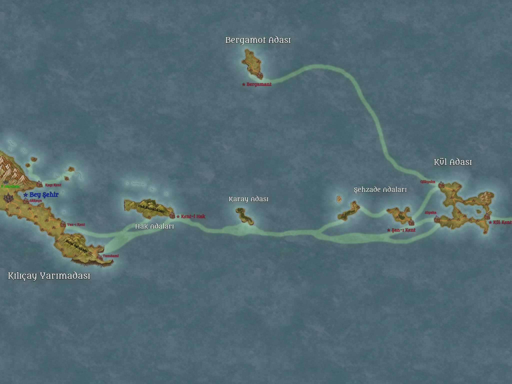

# Tuanşan Beyliği Tarihçesi
**Kılıçay Yarımadası Merkezli Özerk Beylik**  
*Şanlı İmparatorluk’a bağlı koloni devleti*





---

## 1. Genel Bakış

**Kuruluş Yılı:** 1123 (İşgal Sonrası) – Kül Adası’nın resmî ilhakı  
**Günümüz:** 1326 (İşgal Sonrası) – Beyliğin 203. yılı  
**Başkent:** Beykent (Kılıçay Yarımadası)  
**Resmî Dil:** Common (İnsanların ortak dili)  
**Yönetim Biçimi:** Kalıtsal Beylik (Tuanşan Hanesi)  
**İmparatorlukla İlişki:**  
- İç işlerinde **tamamen özerk**.  
- Yıllık vergi öder, göç ve erzak desteği alır.  
- Kendi inisiyatifiyle genişleme seferi düzenlemezse İmparatorluk müdahale etmez.  
- İmparatorluk yağma/akın istediğinde geçiş hakkı ve lojistik sağlar; ganimetin büyük kısmı İmparatorluğa gider.

**Nüfus (yaklaşık 1326):**
| Bölge                  | Nüfus     |
|------------------------|-----------|
| Kılıçay Yarımadası     | 121.450   |
| Kül Adası              | 57.820    |
| Hak Adaları            | 28.940    |
| Şehzade Adaları        | 23.670    |
| Bergamot Adası         | 12.890    |
| Karay Adası            | 1.850     |
| **Toplam**             | **~246.620** |

**Önemli Notlar:**
- İnsan olmayan ırklar yasal olarak ikinci sınıftır.  
- **İstisnalar:**  
  - Akçakale’deki Ak Cüceler ve az sayıda gnome (eşit haklara sahip).  
  - **Tuan-djer** klanı (bronz tenli dragonbornlar): Yalnızca Sami Bataklığı’nda **tam vatandaşlık** haklarına sahiptir. Nüfusları 1.650–1.900 arasındadır ve seferlere katılabilirler.  
- Lizardfolk dilinin ejder diline benzerliği **tesadüftür**; herhangi bir kadim bağ yoktur.

---

## 2. Kronolojik Tarihçe (1123 – 1326)

### I. Kuruluş ve İlk Kolonileşme (1123 – 1155)
**0** – Drow işgali sona erer. İşgal Sonrası takvim başlar.  
**1123** – Loe-raen deniz savaşı sırasında sürüklenen gemi Kül Adası’na oturur. Kaptan Kül’ün raporu üzerine İmparator III. Şan-ı Azim keşif filosu gönderir. Ada boş bulunur ve resmen ilhak edilir.  
**1124** – İlk kalıcı yerleşim kurulur. Ada, imparatorluğa bağlı bağımsız beylik statüsünde ilan edilir.  
**1128** – Veliaht Prens **Tuan** belden aşağı felç olur. Tahttan men edilir. İmparator emriyle Tuan ve soyu **Tuanşan Hanesi** olarak hanedandan ayrılır; Kül Adası ve çevresi kendilerine verilir.  
**1130 – 1155** – Şehzade Adaları, Karay Adası ve Bergamot Adası keşfedilir ve kolonileştirilir. Göçmenler: savaş gazileri, toprak karşılığı şehirliler ve sürgün suçlular.

### II. Hak Adaları ve Lizardfolk Soykırımı (1156 – 1180)
**1156** – Hak Adaları’na çıkılır. İlk lizardfolk teması gerçekleşir.  
**1157 – 1163** – Tuanşan kuvvetleri (İmparatorluk desteğiyle) adaları işgal eder. Yerel lizardfolk nüfusu neredeyse tamamen katledilir. Hayatta kalanlar başkente götürülür; dillerinin ejder diline benzerliği fark edilir (tesadüf olduğu sonradan anlaşılır).  
**1164** – Hak Adaları resmen Tuanşan toprağı ilan edilir. Kent-Hak kurulur.

### III. Kılıçay Yarımadası Fethi ve Başkent Taşınması (1181 – 1220)
**1181** – Kılıçay Yarımadası keşfedilir.  
**1182 – 1195** – Lizardfolk kabileleriyle uzun ve kanlı savaşlar. Yarımada ele geçirilir.  
**1196** – **Beykent** kurulur (ilk surlu şehir).  
**1201** – Başkent resmen Kül Adası’ndan Beykent’e taşınır. Tuanşan Beyliği’nin merkezi artık kıtadır.  
**1205 – 1220** – Yarımadada sistematik yerleşim ve sur inşası. Sami Bataklığı’na Tuan-djer dragonborn klanı yerleştirilir ve kendilerine tam vatandaşlık hakkı tanınır.

### IV. Konsolidasyon ve Altın Çağ (1221 – 1280)
**1221 – 1250** – Göreli barış dönemi. Ticaret yolları açılır, Akçakale madenleri işletmeye alınır (Ak Cücelerle özel anlaşma).  
**1253** – II. Tuan ölür. Yerine oğlu **III. Tuan** geçer.  
**1260’lar** – Beyliğin nüfusu hızla artar. İmparatorluk’tan düzenli göç dalgaları gelir.  
**1278** – İlk büyük iç isyan (Hak Adaları’nda lizardfolk kalıntıları ve insan yerleşimciler arasında). Bastırılır.

### V. Gerilim ve Günümüz (1281 – 1326)
**1285** – Aelthirion Yüksek Elf Krallığı ile sınır gerilimi başlar (kuzeybatı deniz ticareti yüzünden).  
**1298** – III. Tuan ölür. Yerine kızı **Leyla Tuanşan** geçer (ilk kadın bey).  
**1305 – 1312** – İmparatorluk’un büyük doğu seferine lojistik destek verilir. Tuanşan gemileri ve askerleri önemli rol oynar.  
**1318** – Leyla Tuanşan ölür. Yerine oğlu **IV. Tuan** geçer.  
**1320’ler** – İçeride “insan üstünlüğü” yasalarının sertleşmesi, dışarıda ise Aelthirion ve doğu krallıklarıyla artan diplomatik gerilim.  
**1326** – Günümüz. Beylik 203 yaşındadır. IV. Tuan 34 yaşındadır ve henüz veliaht belirlememiştir.

---

## 3. Tuanşan Hanesi Soyağacı

```
İmparator III. Şan-ı Azim
│
└── Tuan (I. Tuan)  [Felçli Prens, 1102–1168]
    ├── (eşi: Lady Börte of Lietchin)
    │
    └── II. Tuan  [1168–1253]
        ├── (eşi: Lady Selene of Duelwealth)
        │
        └── III. Tuan  [1253–1298]
            ├── (eşi 1: Lady Alcı)
            │   └── (erkek çocuklar – genç yaşta öldü)
            │
            └── (eşi 2: Lady Yesui of Karay)
                └── Leyla Tuanşan  [1298–1318]  ← İlk kadın bey
                    ├── (eşi: Lord Temür of Şan)
                    │
                    └── IV. Tuan  [1318–günümüz]  (d. 1292)
                        ├── (eşi: Lady Elara of Aelthirion – diplomatik evlilik, 1319)
                        │
                        ├── Prenses Sera  (d. 1320)
                        └── Prens Orhan  (d. 1323)
```

**Not:** Hanedan, İmparatorluk Şan soyundan kopmuş olsa da hâlâ “Şan kanı” taşıdığını iddia eder. Bu durum hem meşruiyet hem de gerilim kaynağıdır.

---

## 4. Önemli Karakterler (1326)

### Tuanşan Hanesi
| İsim              | Yaş | Rol / Unvan                  | Kısa Açıklama |
|-------------------|-----|------------------------------|---------------|
| **IV. Tuan**      | 34  | Bey                          | Soğukkanlı, pragmatist. Henüz veliaht atamadı. Aelthirion ile evlilik sayesinde elflerle gergin barış sağladı. |
| **Lady Elara**    | 31  | Bey eşi (Aelthirion)         | Yüksek elf. Diplomatik evlilik. Beykent’te “yabancı” olarak görülür, ama zekâsı sayesinde saygı görür. |
| **Prenses Sera**  | 6   | Veliaht adayı?               | Babasının favorisi. Keskin zekâlı. |
| **Prens Orhan**   | 3   | —                            | Henüz çok küçük. |

### Önemli Soylular ve Görevliler
| İsim                     | Yaş | Rol                          | Kısa Açıklama |
|--------------------------|-----|------------------------------|---------------|
| **Lord Kadan Alçaka**    | 52  | Kül Adası Valisi             | Muhafazakâr, “eski usul” koloni taraftarı. Başkentin taşınmasına hâlâ içerler. |
| **Leydi Börte Hak**      | 41  | Hak Adaları Valisi           | Sert, militarist. Lizardfolk kalıntılarına karşı amansız. |
| **Başvezir Esen**        | 58  | Bey’in Başdanışmanı          | Eski savaş gazisi. IV. Tuan’ın en güvendiği adam. |
| **Amiral Subutai Kül**   | 47  | Donanma Komutanı             | Kaptan Kül’ün soyundan. Deniz gücünün mimarı. |
| **Usta Thorin Aktaş**    | 89  | Akçakale Maden Ustası (Cüce) | Azınlık haklarına sahip nadir cücelerden. Bey’e sadık. |
| **Şaman Vex’tar**        | 34  | Tuan-djer Klan Reisi         | Bronz tenli dragonborn. Sami Bataklığı’nda yaşar. Tam vatandaşlık hakkına sahip. Beyliğe minnettar ama temkinli. Seferlere katılabilir. |

### Tarihi Figürler (Önemli)
- **I. Tuan** (1102–1168): Felçli prens. Beyliğin kurucusu. Tahttan düşürülmesine rağmen efsanevi bir figür.
- **Leyla Tuanşan** (1266–1318): İlk kadın bey. 20 yıllık saltanatı “Altın Dönem”in sonunu getirdi. Hem sevildi hem de “kadın hükümdar” diye eleştirildi.

---

## 5. Güncel Durum (1326) – Özet

Tuanşan Beyliği, 203 yıllık tarihinde küçük bir ada kolonısından, Kılıçay Yarımadası’nda merkezlenmiş, ciddi askerî ve ekonomik güce sahip özerk bir beyliğe dönüşmüştür.  

İçeride insan-merkezli katı hiyerarşi devam ederken, **Tuan-djer** klanı (bronz tenli dragonbornlar) Sami Bataklığı’nda tam vatandaşlık hakkına sahiptir ve seferlere katılabilir.  

Dışarıda Aelthirion Yüksek Elf Krallığı ile kırılgan bir barış ve İmparatorluk’la karşılıklı çıkar ilişkisi vardır.  

IV. Tuan’ın henüz net bir veliaht belirlememiş olması ve küçük çocukları, önümüzdeki yıllarda hanedan içi gerilim potansiyeli taşımaktadır.

---

*Bu belge Tuanşan Beyliği’nin resmî tarihçesi olarak hazırlanmıştır.  
Son güncelleme: 1326 (İşgal Sonrası)*


